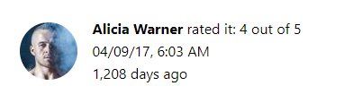
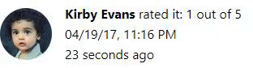
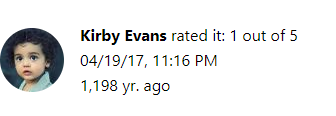

# Format a Date Relative to the Current Date Using react-intl FormattedRelative

**[📹 Video](https://egghead.io/lessons/react-format-a-date-relative-to-the-current-date-using-react-intl-formattedrelative)**

## Using the FormattedRelativeTime Component ⚡
### Deprecation ⚠
As of react-intl v3, `FormattedRelative` has been renamed to `FormattedRelativeTime`, the value prop accepts a delta instead of a `Date`, `updateInterval` has been changed to `updateIntervalInSeconds`, and the `style` prop has been changed.

We'll start by importing `FormattedRelativeTime` from react-intl in **src/components/BookDetail.js**
### BookDetail.js
```js
import { 
  FormattedMessage,
  FormattedDate,
  FormattedTime,
  FormattedRelativeTime
} from 'react-intl' 
```
Now we can go into our `BookDetail` component and add a `FormattedRelativeTime` component after our `FormattedTime` component from the previous lesson.

**Note**: The `FormattedRelativeTime` component now expects a delta (difference between times) passed into its `value` prop instead of a `Date`. Furthermore, we must also define the units of the delta with a `unit` prop.

### BookDetail.js
```jsx
...
<FormattedTime
value={new Date(review.date)}
year="2-digit"
month="2-digit"
day="2-digit" /><br />

// New Component
<FormattedRelativeTime 
  value={-1 * Math.floor((Date.now() - review.date)/((1000*60*60*24)))} 
  unit="days"/><br />

...
```

To the `value` prop, I pass in a function which calculates the difference between today's date and the date of the review, converts that number (milliseconds) to days, then multiplies that number by `-1` because the review occurred prior to today's date.

Furthermore, because my value is in days, I pass `"days"` into the `unit` prop. 

Now if we start our development server,
```bash
yarn start
```
We can navigate to our localhost port in the browser and see that the relative date is formatted as expected:



By default, this component will automatically re-render at a maximum of every 10 seconds. We can specify our update interval with the `updateIntervalInSeconds` prop.

To use this prop, we need to make sure our `unit` prop is assigned a unit no longer than an hour. Then, we can simply pass in the number of seconds we want between update intervals.
### BookDetail.js
```jsx
<FormattedRelativeTime 
  value={0}
  unit="second"
  updateIntervalInSeconds="1"/><br />
```

We can return to our site and see that our displayed relative time is indeed updating every 1 second.



The `updateIntervalInSeconds` prop could severely slow down your site in production, as it is re-rendering the component at every interval. This can be especially unwanted if the component re-renders every second, but the relative time isn't changing because it's beyond displaying individual seconds.

Finally, the instructor shows us how we can set our component to always display a number. For this, the `style` prop is used; however, this prop has been changed.

Now, if you want your component to always render a number, the `numeric="always"` prop should be passed in.

Furthermore, the `style` prop now accepts either `long`, `short`, or `narrow`. The `long` setting displays the unit in it's full form, while the `short` and `narrow` settings display the shorthand form of the unit (sec., min., hr., yr.).

### BookDetail.js
```jsx
<FormattedRelativeTime 
  value={-1 * Math.floor((Date.now() - review.date)/((1000*60*60*24)))}
  unit="year"
  style="short"
  numeric="always"/><br />
```



## Resources 📖
- [FormattedRelativeTime - react-intl](https://formatjs.io/docs/react-intl/components/#formattedrelativetime)