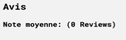
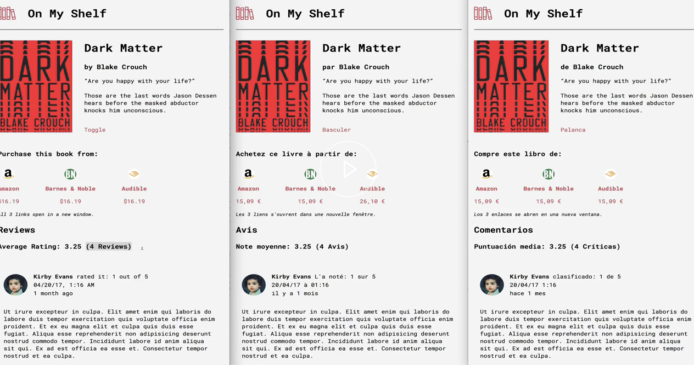

# Render Content Based on a Number using react-intl FormattedMessage

**[📹 Video](https://egghead.io/lessons/react-render-content-based-on-a-number-using-react-intl-formattedmessage)**

## Making our Messages More Friendly ⚡
Currently, no matter how many reviews a book has, our app always renders the number of reviews, then the word reviews.



We can make this more friendly by first changing our `avgRating` variable in **src/components/BookDetail.js**. Let's have the variable evaluate to what it is now when `book.reviews.length` is true (when there are book reviews), and have it evaluate to 0 when `book.reviews.length` is false (there are no book reviews).

### BookDetail.js
```js
const avgRating = book.reviews.length ? round(meanBy(book.reviews, (r) => r.rating), 2) : 0;
```

Now, let's head down to our average rating `FormattedMessage` component and pass another object into `values` with key `count` and value `book.reviews.length`. Furthermore, we'll delete the text in the parenthesis that follows it.

### BookDetail.js
```js
<h3>
    <FormattedMessage id="detail.averageRating" values={{avg: avgRating, count: book.reviews.length}} />
</h3>
``` 

Back in our **src/messages.js**, we'll put our new `count` value with a placeholder in the `averageRating` message. We're also going to include the keyword `plural`, which will allow us to conditionally render messages based on the value of `count`.

### messages.js
```js
averageRating: 'Average Rating: {avg} ({count, plural, =0 {No Reviews Yet!} one {# Review} other {# Reviews}})',
```

To the right of the comma next to `plural`, we're conditionally rendering messages based on the value of `count`.

- `=0 {No Reviews Yet!}` tells react-intl to display "No Reviews Yet!" when `count` is 0
- `one {# Review}` tells react-intl to display a message when `count` is 1. The `#` symbol is a placeholder for the value of `count`, so in this case the message displayed would be "1 Review"
- `other {# Reviews}` tells react-intl to display a message when `count` is neither of the previously described conditions (0 or 1). `#` is a placeholder for the value of `count`, so the message will be "{value of count} Reviews".

Now we should add this functionality to the other languages:
### messages.js
```js
export default {
  'en-US': {
    detail: {
      author: 'by {author}',
      toggle: 'Toggle',
      purchase: 'Purchase this book from:',
      window: '<small><em>All {numMerchants} links open in a new window.</em></small>',
      reviewsHeading: 'Reviews',
      averageRating: 'Average Rating: {avg} ({count, plural, =0 {No Reviews Yet!} one {# Review} other {# Reviews}})',
      userRating: '{name} rated it: {rating} out of 5'
    }
  },
  'es': {
    detail: {
      author: 'de {author}',
      toggle: 'Palanca',
      purchase: 'Compre este libro de:',
      window: '<small><em>Los {numMerchants} enlaces se abren en una nueva ventana.</em></small>',
      reviewsHeading: 'Comentarios',
      averageRating: 'Puntuación media: {avg} ({count, plural, =0 {No hay comentarios todavía!} one {# Crítica} other {# Críticas}})',
      userRating: '{name} clasificado: {rating} de 5'
    }
  },
  'fr': {
    detail: {
      author: 'par {author}',
      toggle:'Basculer',
      purchase: 'Achetez ce livre à partir de:',
      window: '<small><em>Les {numMerchants} liens s\'ouvrent dans une nouvelle fenêtre.</em></small>',
      reviewsHeading: 'Avis',
      averageRating: 'Note moyenne: {avg} ({count, plural, =0 {Pas encore de commentaires!} one {# La revue} other {# Avis}})',
      userRating: '{name} L\'a noté: {rating} sur 5'
    }
  }
}
```

Now if we start our development server,
```bash
yarn start
```
And navigate to our localhost port, we should see that our average rating message is properly displayed for any number of reviews on any supported language.

### Many Reviews, Different Languages


### No Reviews


## Resources 📖
- [FormattedMessage Plural Format - react-intl](https://formatjs.io/docs/icu-syntax#plural-format)