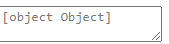

# Use a react-intl Higher Order Component to format messages and get current locale

**[📹 Video](https://egghead.io/lessons/react-use-a-react-intl-higher-order-component-to-format-messages-and-get-current-locale)**

## Accepting User Reviews ⚡
At the bottom of **src/components/BookDetail.js**, let's add a `textarea` element where users can add their own review. In this `textarea` element, we want a `placeholder` attribute to tell the user what the `textarea` is for. However, we want this `placeholder` value to be in the user's language.

### BookDetail.js
```jsx
      ...
      </div>

      <textarea placeholder=""></textarea>
      
    </div>
  )
}

export default BookDetail;
```

We'll first navigate to our **src/messages.js** file and add an `inputPlaceholder` message for each language.

### messages.js
```js
export default {
  'en-US': {
    detail: {
      ...
      inputPlaceholder: 'What did you think? Enter your review here.'
    }
  },
  'es': {
    detail: {
      ...
      inputPlaceholder: '¿Que piensas? Introduzca su comentario aquí.'
    }
  },
  'fr': {
    detail: {
      ...
      inputPlaceholder: 'Qu\'as-tu pensé? Entrez votre avis ici.'
    }
  }
}
```

Next, we'll navigate back to our `textarea` element in **src/components/BookDetail.js**.

You may think to pass a `FormattedMessage` component with `id="details.inputPlaceholder"`  to our `textarea` `placeholder` attribute. However, if we do that,
```jsx
<textarea placeholder={<FormattedMessage id="detail.inputPlaceholder"/>}/>
```
And start our development server,
```bash
yarn start
```
Our `textarea` wil be rendered like this:



The `FormattedMessage` component doesn't actually render like we'd expect when it's inside of the `placeholder` attribute.

## Using the injectIntl Higher Order Component ⚡
We can fix this issue with the react-intl `injectIntl` higher order component.

We'll start by importing `injectIntl` from react-intl in our `BookDetail` component.

### BookDetail.js
```js
import { 
  FormattedMessage,
  FormattedDate,
  FormattedTime,
  FormattedRelativeTime,
  FormattedNumber,
  injectIntl
} from 'react-intl' 
```

Next, we'll have our `BookDetail` component accept an `intl` argument which will be passed in by the `IntlProvider` parent component.

### BookDetail.js
```js
const BookDetail = ({match, intl}) => {
    ...
}
```


Now we can provide our `placeholder` attribute with the value `intl.formatMessage({id: 'detail.inputPlaceholder'})`
### BookDetail.js
```jsx
<textarea placeholder={intl.formatMessage({id: 'detail.inputPlaceholder' })}></textarea>
```

"The intl `formatMessage()` method is actually the underlying API that the `FormattedMessage` component uses, but we bypass the React component creation step and just get the string at `detail.inputPlaceholder` in the messages file."

Our final step is to wrap the `BookDetail` export in an `injectIntl` higher order component.
### BookDetail.js
```js
export default injectIntl(BookDetail);
```

## The intl Prop ⚡
With the `intl` prop passed into our `BookDetail` component, we can access the user's locale without the navigator lookup in the `BookDetail` component because the `locale` variable is already set up and passed into `IntlProvider` in **src/index.js**.

### index.js
```js
let locale = (navigator.languages && navigator.languages[0])
             || navigator.language
             || navigator.userLanguage
             || 'en-US';

ReactDOM.render(
  <IntlProvider locale={locale} messages={flattenMessages(messages[locale])}>
    <App />
  </IntlProvider>,
  document.getElementById('root')
);
```

Therefore, we can remove the `locale` variable from our `BookDetail` component, and access it instead with `intl.locale`.

### BookDetail.js
```jsx
const BookDetail = ({match, intl}) => {
  const book = books.find(book => book.id === parseInt(match.params.bookId, 10));
  const sortedReviews = sortBy(book.reviews, 'date').reverse();
  const avgRating = book.reviews.length ? round(meanBy(book.reviews, (r) => r.rating), 2) : 0;

  return (
    ...
    <FormattedNumber
        value={merchant.price[intl.locale]}
        style="currency"
        currencyDisplay="symbol" 
        currency={intl.locale === 'en-US' ? 'USD' : 'EUR'}/>
    ...
  )
}

```

We should now be able to save our changes and view our site to see that it looks no different.

### Resources
- [Injection API - react-intl](https://formatjs.io/docs/react-intl/api#injection-api)