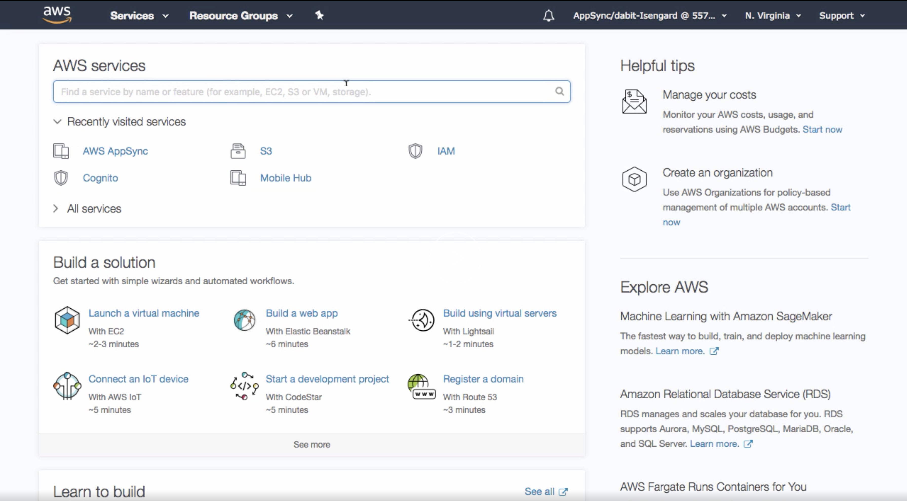
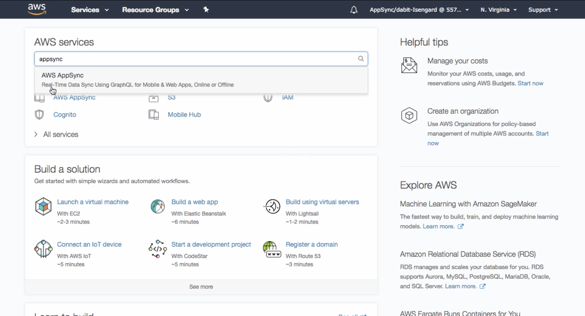

# Create & Interact with an AWS AppSync GraphQL API with AWS Amplify

> ❗ AWS Amplify is a framework in constant change and improvement. If you find something here or in the video that is outdated, or not working, please make sure you check the [Official documentation](https://docs.amplify.aws/) to clear your doubts.

**[📹 Video](https://egghead.io/lessons/react-native-create-interact-with-an-aws-appsync-graphql-api-with-aws-amplify)**

## AWS Amplify !== AWS AppSync

[Appsync](https://aws.amazon.com/appsync/) is the AWS service focus on creating flexible APIs, and Amplify is the framework that combines multiple AWS tools to help you build any type of Application.

## Create a GraphQL API

```bash
amplify add api
```

Select the following options:

- Select GraphQL
- When asked if you have a schema, say No
- Select one of the default samples; you can change this later
- Choose to edit the schema and it will open the new `schema.graphql` in your editor

In this example, we are just adding a new property to our `Todo` model and save it:

```graphql
type Todo @model {
  id: ID!
  name: String!
  description: String
  completed: Boolean # 👈🏼 You just need to add this property. the others should be there already
}
```

> 🤔 If you want to learn more about GraphQL, you can go to the official documentation! 👉🏼 https://graphql.org/learn/

- after you safe your new GraphQL schema, you can see in the command line that all the resources has been created **locally**. Now you are ready to push all of it to our AWS account with the command:

```bash
$ amplify push
```

- Now lets go to the AWS Console to interact with our newly created GraphQL API:




- Once you are there, you can search for your newly created GraphQL API, and click to view it
- If you click the `Schema` section, you will see the full generated schema
- Now click in `Queries` to start making our first queries withing the AWS console GraphQL Inspector


- You have the API documentation available on the right side of the UI


- The documentations panel is interactive, you can go and click through all the Query and Mutation Definitions to check what is available to do with the API

> "The `Schema` is like a Restaurant menu, and a `Query` is like your order"
>
> _Eve's Brother_ - [source](https://twitter.com/eveporcello/status/1300963959307001858)

- 🤔 The Interface that let you execute queries, and mutations to a GraphQL API is called [GraphiQL](). It's (in my personal opinion) one of the greatest features about GraphQL as a tool. It makes very easy to test, document and interact with your GraphQL API. Checkout more info [here](https://github.com/graphql/graphiql).
- AWS Appsync has it Built-in in the Console to make it more accessible and setup to your needs. (that's awesome!)


Let's start by creating our first [`mutation`](https://graphql.org/learn/queries/#mutations) by typing the above code in the UI:

```graphql
mutation create {
  createTodo(
    input: {
      name: "Get Groceries"
      description: "Go to wal-mart"
      completed: false
    }
  ) {
    id
    name
    description
    complete
  }
}
```

- To execute the mutation, you can either click in the orange play button, or press enter while the cursor is at any point of the mutation


You can repeat the above process with different info as much as you want (in the video Nader creates two todos)

Now lets go and create our First Query

```graphql
query list {
  listTodos {
    items {
      id
      name
      description
      completed
    }
  }
}
```

- After you execute the query, you should see in the GraphiQL right side panel the result of the query, which is an array of all the available todos in the system.


- Now that we got some data, we can go and query the data from our React app!
- In `App.js`, import `API` and `graphqlOperation` from `aws-amplify`

> 🤔 Remember that you need to [Configure your React App](03-react-native-use-the-aws-amplify-withauthenticator-hoc-to-implement-a-react-user-authorization-flow.md) in order to successfully connect your app with your AWS Amplify Services

```javascript
import { API, graphqlOperation } from "aws-amplify"
```

- Now copy the listTodos query from the AWS AppSync console and paste it in the component like so:

```javascript
const ListTodos = ` 
  query { 
    listTodos {
      items { 
        id name description completed 
      }
    }
  }
`
```

- and last lets glue all together in React (the example above is using Functional components, not Class components as in the video)

```javascript
import React from 'react'
import { API, graphqlOperation } from "aws-amplify"

const ListTodos = `
  query {
    listTodos {
      items {
        id name description completed
      }
    }
  }
`

export default function App() {
  const [todos, setTodos] = React.useState([]) // important to initialize your state with an empty array!

  React.useEffect(() => {
    async function getTodos() {
      const todoData = await API.graphql(graphqlOperation(ListTodos)) // fetch the list of Todos from your graphQL API
      setTodos(toData.data.listTodos.items) // set the result from your query to your local state
    }

    getTodos() // Async functions are not permitted as `useEffect` functions parameters. that's why I created another async function inside of it instead
  }, [])

  return (
    <div className="App">
      <header className="App-header">
        
        <h1 className="App-title">Welcome to React</h1>
      </header>
      {
        todos.map((todo, i)) => (
          <div>
            <h3>{todo.name}</h3>
            <p>{todo.description}</p>
          </div>
        ))
      }
    </div>
  );
}
```

- when this is ready, you can go to your command line and run `npm start` or `yarn start` and see the result in the browser ([http://localhost:3000/](http://localhost:3000/))


## References & Resources

- [Create a GraphQL API (Official docs)](https://docs.amplify.aws/cli/graphql-transformer/overview#create-a-graphql-api)
- [AWS AppSync main page](https://aws.amazon.com/appsync/)
- ["GraphQL Query Language" course](https://egghead.io/courses/graphql-query-language)
- [Using Amplify GraphQL Client](https://docs.amplify.aws/lib/graphqlapi/query-data/q/platform/js#using-amplify-graphql-client)

---

📹 [Go to Previous Lesson](https://egghead.io/lessons/react-native-manually-sign-up-new-users-in-react-with-aws-amplify-auth-class)
📹 [Go to Next Lesson](https://egghead.io/lessons/react-native-create-interact-with-a-serverless-rest-api-with-aws-lambda-from-react)
