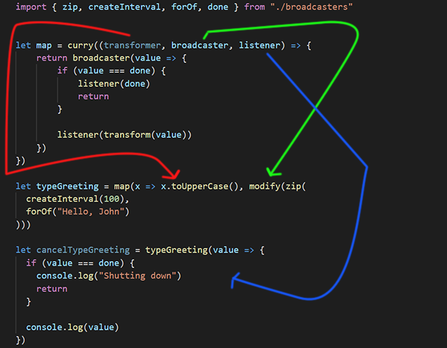

# Lesson 20 - Transform Values with a Map Operator

- We can use the `toUpper` method from lodash to uppercase a letter
-  Since the `modify` function we built on the [previous lesson]() changes a behaviour of our broadcaster, we can call it `operators`

Grabbing the template from our `modify` function we can change it to turn everything in the broadcaster to uppercase

```javascript
let map = curry((broadcaster, listener) => {
	return broadcaster(value => {
		if (value === done) {
			listener(done)
			return
		}
		
		listener(value.toUpperCase())
	})
})

```

Since hard coding things isn't a good idea, we could pass another parameter to our `map` function that will do the uppercasing of the string.

```javascript

let map = curry((transformer, broadcaster, listener) => {
	return broadcaster(value => {
		if (value === done) {
			listener(done)
			return
		}
		
		listener(transform(value))
	})
})

```

So then we can pass another function to `map` that will do the transform we need

```javascript
let typeGreeting = map(x => x.toUpperCase(), modify(zip(
  createInterval(100),
  forOf("Hello, John")
)))

```

Let's break down the `typeGreeting` function:

- The first argument `x => x.toUpperCase()`
	- Is the transformer
-  The second argument `modify()`
	-  Is the broadcaster
-  The third argument `zip()`
	-  Is the listener


