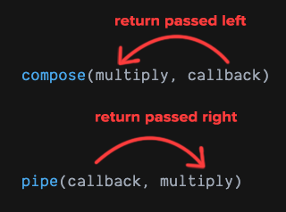

# Lesson 4 - Compose closures and callbacks to create new functions

Composition - a function passing one value to another function

instead of doing:

```javascript
let value = callback()
multiply(value)
```

we can pass callback inside multiply straight away:

```javascript
multiply(callback())
```

Cleaner ways to compose functions:

- using `pipe` from `lodash/fp`
- using `compose` from `lodash/fp`

**example**

```javascript
// multiply(callback()) becomes
pipe(callback, multiply)
```

```javascript
// multiply(callback()) becomes
compose(multiply, callback)
```

compose allows you to refactor the code by removing nested functions and instead list them out in order.



With pipe, each return is passed to the next function in line. 

With compose the return is passed to the previous function in line - so the value returned to the callback will be passed to multiply.

TODO: Add why using compose instead!
