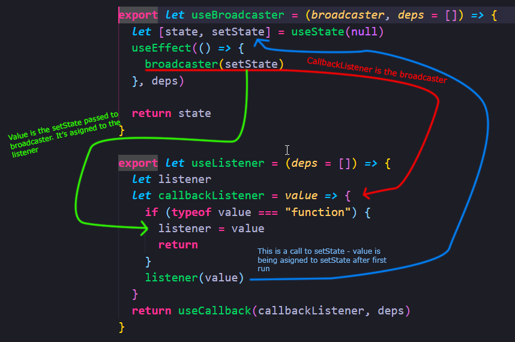

# Explaining the useListener Code

*[📹 Video](https://egghead.io/lessons/egghead-explaining-the-uselistener-code)*



We can think of the `listener` inside `useListener` as `setState()` 

```javascript
export let useListener = (deps = []) => {
  let setState
  let callbackListener = value => {
    if (typeof value === "function") {
      setState = value
      return
    }
    setState(value)
  }
  return useCallback(callbackListener, deps)
}
```

On the first call, we asign the value to `setState`, but on the next calls, we just pass the values to `setState`.

---

📹 [Go to Previous Lesson](https://egghead.io/lessons/egghead-create-a-custom-uselistener-hook-around-usecallback)
📹 [Go to Next Lesson](https://egghead.io/lessons/egghead-handling-an-enter-keypress-with-uselistener-and-react)