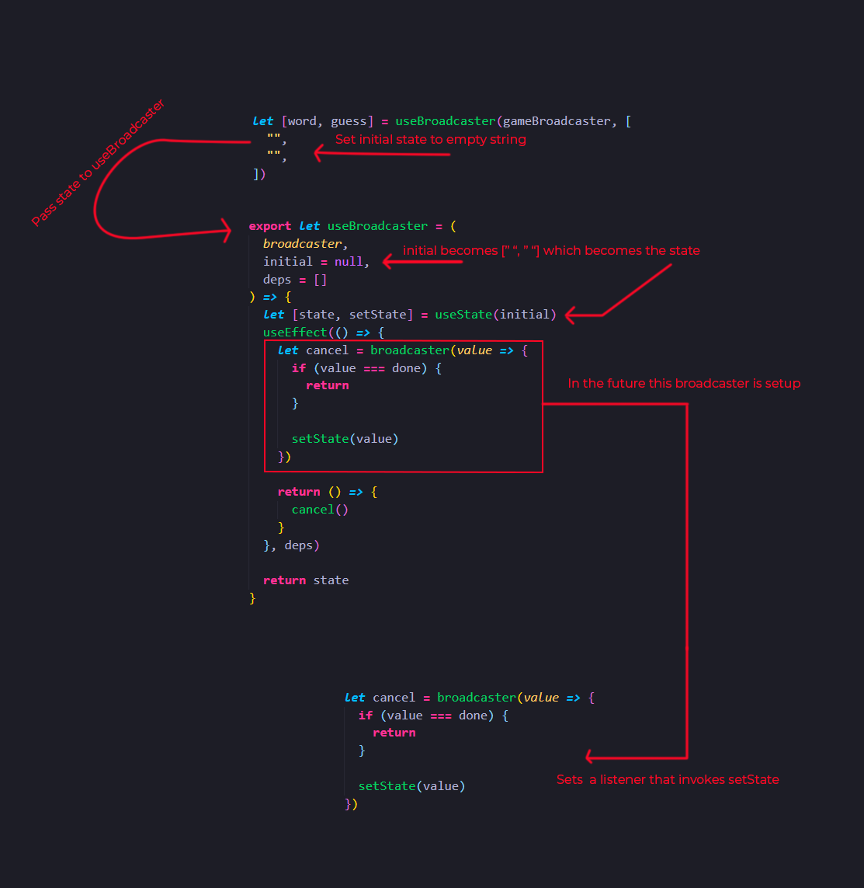
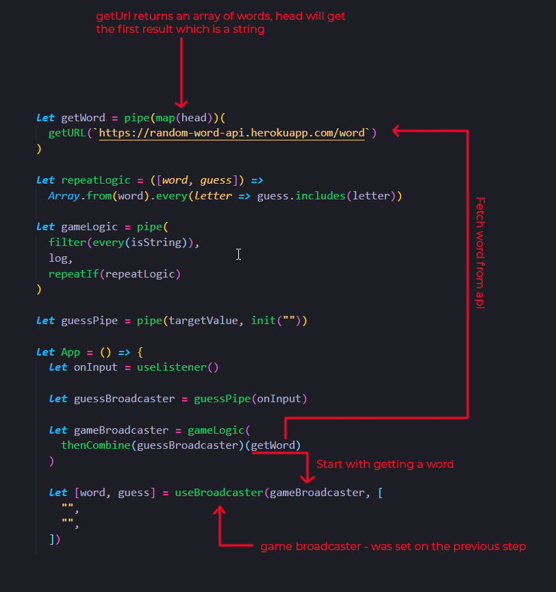
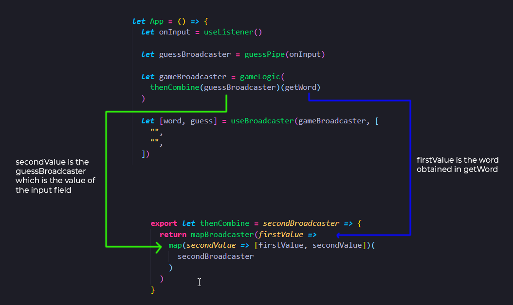
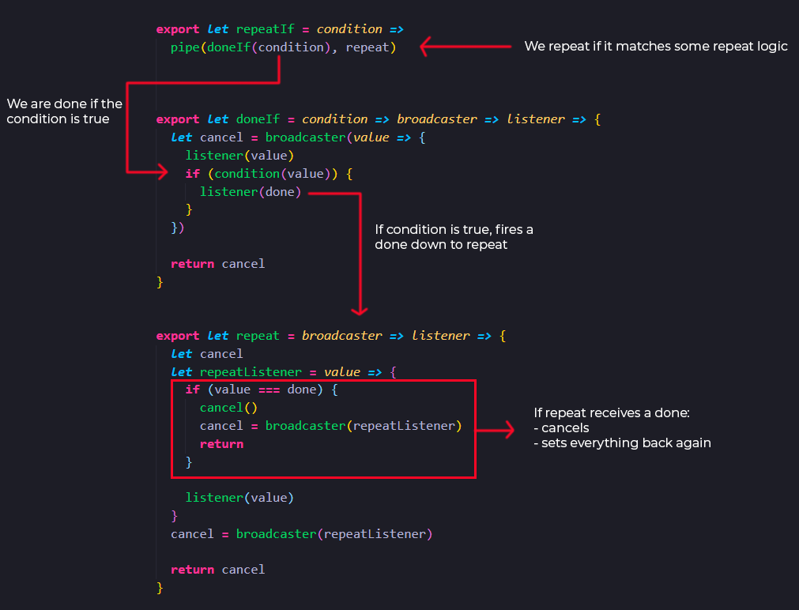

# Walkthrough the Data Flow of the Word Game

[📹 Video](https://egghead.io/lessons/egghead-walkthrough-the-data-flow-of-the-word-game)

## First steps

First, we set up our initial values, state and listener.



## Setting our game

Now the broadcaster that we set up in `useBroadcaster` is the game broadcaster that starts with a word, obtained from `getWord` that fetches a random word from an API endpoint.



## Feeding word to thenCombine and combine with the input word



Then the second broadcaster which is the `onInput` will be passed to the `guessPipe` which gets the targetValue and when it repeats, it sets that input into an empty string.

## The game logic

In our game logic, we are repeating if it matches some repeat logic, which is if every letter of the guess word, was used we win the game and it should repeat the same logic with a new word.



All the logic of hitting the condition inside `repeatLogic` will tear everything down, do another fetch request and set everything up again is contained in the `repeatIf` operator

```js
let repeatLogic = ([word, guess]) =>
  Array.from(word).every(letter => guess.includes(letter))
```