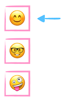
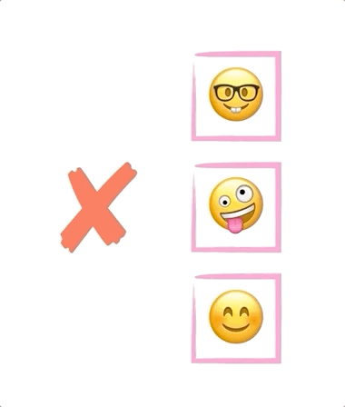

# Stack Data Structure in JavaScript

**[📹 Video](https://egghead.io/lessons/javascript-stack-data-structure-in-javascript)**

💻[Github repo](https://github.com/kyleshevlin/intro-to-data-structures-and-algorithms/blob/master/stacks/index.js)

## Summary


A Stack is a LIFO (Last In First Out) data structure. This means new items are placed on top of the stack, and popped off from the top down.

## Use case

Stacks are useful for anytime you need to go back to the last thing, once you're done doing your current thing.

- UI routing
- Function call stack
- String manipulation

## Example

A stack is commonly used for routing between pages or screens in an app. When you navigate to a new screen, it is pushed onto the top of the stack. This is the screen you currently see in the app. If you click `back` or `cancel` the current screen is popped off the stack and you're taken back to the previous screen.

## Push


Add an item to the top of the stack.

`Array.push()` is used to add an item to the end (top) of an array.

## Pop


Remove and return the top item on the stack.

`Array.pop()` is used to remove and return the item at the end (top) of the array.

## Peek



Access the item at the top of the stack.

`Array[length - 1]` is used to access the last item in the array.

## Length


Find out how many items are on the stack.

`Array.length` is used to determine how many items are in the array.

> ❗Note: The `get` property discussed in the video is not required to query the current length of the stack

## isEmpty



Return a Boolean value (`true` or `false`) as to whether the stack contains items.

`Array.length === 0` is used to determine whether the array currently has zero items. If it does then this method returns `true`. If there are items in the array it will return `false`.

## Implementation

**stacks/index.js**

```js
function createStack() {
  const stack = []

  return {
    push(item) {
      stack.push(item)
    },
    pop() {
      return stack.pop()
    },
    peek() {
      return stack[stack.length - 1]
    },
    length() {
      return stack.length
    },
    isEmpty() {
      return stack.length === 0
    }
  }
}
```

---

📹 [Go to Previous Lesson](https://egghead.io/lessons/javascript-priority-queue-javascript-data-structure)
📹 [Go to Next Lesson](https://egghead.io/lessons/javascript-linked-list-data-structure-in-javascript)
