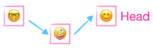
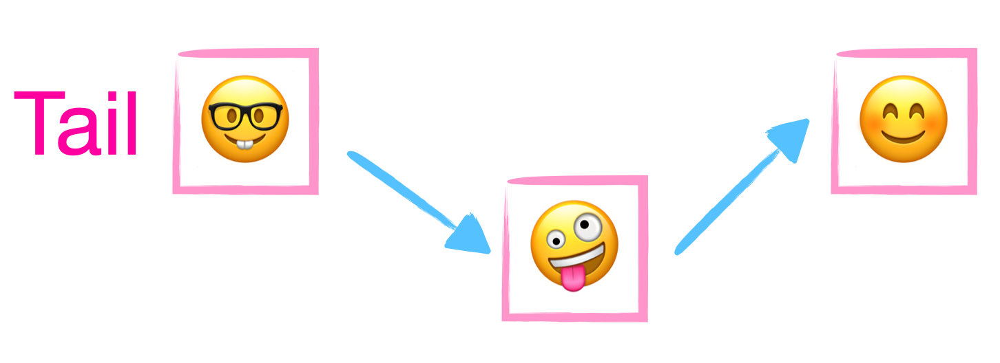
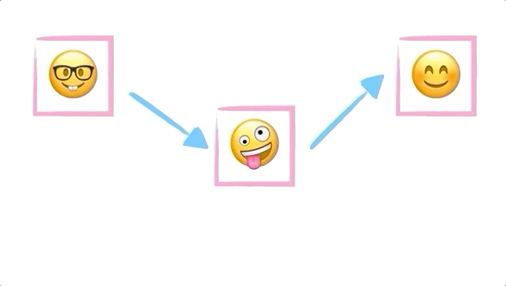
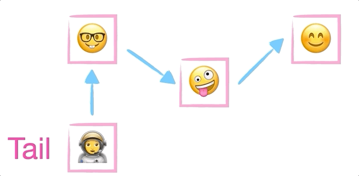
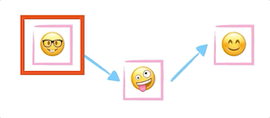
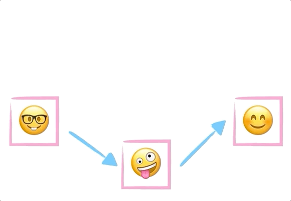
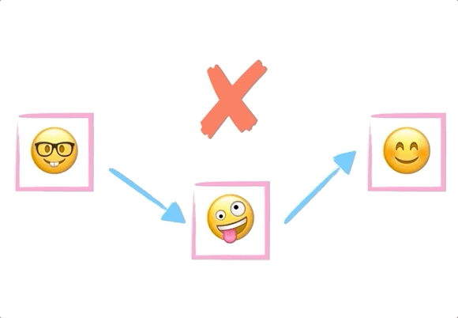

# Linked List Data Structure in JavaScript

**[📹 Video](https://egghead.io/lessons/javascript-linked-list-data-structure-in-javascript)**

💻[Github repo](https://github.com/kyleshevlin/intro-to-data-structures-and-algorithms/blob/master/linkedLists/index.js)

## Summary


Linked lists are a collection of nodes, each pointing to the next node. A linked list has a head - representing the start - and a tail - representing the end. These can both be the same node if the list's length is 1, or null if the list is empty. Otherwise, they represent the first and last nodes in the list, and help us determine whether the current node is at the start, end or somewhere in the middle.

## Use case

A linked list is perfect for anytime you need to process things in sequence, using the current item to locate the next item

- Play queue in music app
- Dynamic collections in languages where arrays have a static size (C++, Java, Rust)

## Analogy

A linked list is like a train, with a collection of carriages that are linked to the carriage in front. The head of the train is the engine room where the driver is, and then tail is the last carriage in the line. When the train stops, it can add a carriage by just connecting it to the tail carriage. This new carriage then becomes the tail 🚂

## States

The thing that adds the majority of complexity to a linked list is that the methods usually need to account for three states:

🟥Empty list
🟨List with one item
🟩List with more than one item

## Node

A node is just any item within a list. The thing that makes a node special is it contains a link to the next node in the list.

🟥A node can't exist in an empty list
🟨The single node's `next` property is set to `null`
🟩The last node's `next` property is set to null, all other nodes point to the next node

## Head



The head is the first/oldest node added to the list - conceptually, `Array[0]`.

🟥The `head` is set to `null`
🟨The `head` is set to the only node in the list
🟩The `head` is set to the first item in the list

## Tail



The tail is the last/most recently added item in the list - conceptually, `Array.length - 1`.

🟥The `tail` is set to `null`
🟨The `tail` is set to the only node in the list
🟩The `tail` is set to the last item in the list

## Length



This returns the length or how many nodes are currently in the list.

🟥0
🟨1
🟩n

## Push


Push adds a new node to the end of the list. This becomes the new tail and the length is incremented by one. The new node is returned from `.push()`

🟥Sets `head` and `tail` to new node. Sets node's `next` to `null`
🟨Sets the current `tail`'s `next` to new node. Sets new node as `tail`.
🟩Sets the current `tail`'s `next` to new node. Sets new node as `tail`.

## Pop



Pop removes the node at the end of the list - tail - and returns it.

🟥Returns null
🟨Sets `head` and `tail` to `null`. Returns node that was both `head` and `tail`.
🟩Sets `tail` to node before `tail` (iterates from `head` calling `.next()` to find). Sets new `tail`'s next to null. Returns original `tail`.

## Get



Get returns a node at a particular index, without removing it from the list.

🔴Index outside the bounds of list: `< 0` or `> length - 1` **returns `null`**
🟡Index zero **returns `head`**
🟢Index other than zero (in bounds) **returns node at index**

## Delete



Removes the node at the specified index and returns it.

🔴Index outside the bounds of list: `< 0` or `> length - 1` **returns `null`**
🟡Index zero **sets `head` to second node in list and returns original `head`**
🟢Index other than zero (in bounds) **sets node before index's next to the node at index's next and returns node** If the `tail` is being deleted the second last node becomes the `tail`

## isEmpty



Returns whether the list contains nodes. This can simply return whether the list's `.length()` is zero.

🟥Returns `true`
🟨Returns `false`
🟩Returns `false`

## Implementation

```js
function createNode(value) {
  return {
    value,
    next: null
  }
}

function createLinkedList() {
  return {
    head: null,
    tail: null,
    length: 0,
    push(value) {
      const node = createNode(value)

      if (this.head === null) {
        this.head = node
        this.tail = node
        this.length++
        return node
      }

      this.tail.next = node
      this.tail = node
      this.length++

      return node
    },
    pop() {
      if (this.isEmpty()) {
        return null
      }

      const node = this.tail

      if (this.head === this.tail) {
        this.head = null
        this.tail = null
        this.length--
        return node
      }

      let current = this.head
      let penultimate
      while (current) {
        if (current.next === this.tail) {
          penultimate = current
          break
        }

        current = current.next
      }

      penultimate.next = null
      this.tail = penultimate
      this.length--

      return node
    },
    get(index) {
      if (index < 0 || index > this.length - 1) {
        return null
      }

      if (index === 0) {
        return this.head
      }

      let current = this.head
      let i = 0

      while (i < index) {
        i++
        current = current.next
      }

      return current
    },
    delete(index) {
      if (index < 0 || index > length - 1) {
        return null
      }

      if (index === 0) {
        const deleted = this.head

        this.head = this.head.next
        this.length--

        return deleted
      }

      let current = this.head
      let previous
      let i = 0

      while (i < index) {
        i++
        previous = current
        current = current.next
      }

      const deleted = current
      previous.next = current.next

      if (previous.next === null) {
        this.tail = previous
      }

      this.length--

      return deleted
    },
    isEmpty() {
      return this.length === 0
    }
  }
}
```

---

📹 [Go to Previous Lesson](https://egghead.io/lessons/javascript-stack-data-structure-in-javascript)
📹 [Go to Next Lesson](https://egghead.io/lessons/javascript-javascript-graph-data-structure)
