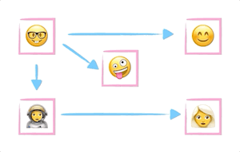

# Breadth First JavaScript Search Algorithm for Graphs

**[📹 Video](https://egghead.io/lessons/javascript-breadth-first-javascript-search-algorithm-for-graphs)**

💻[Github repo](https://github.com/kyleshevlin/intro-to-data-structures-and-algorithms/blob/master/graphs/breadthFirstSearch.js)

## Summary



Breadth first search is an algorithm we can use to traverse all nodes in a graph. It starts at one node and visits all of that node's neighbors before moving on to the next node's neighbors. This is what the "Breadth" in the name implies, as it will visit widely across a node's neighbors, before traversing the edges of a neighboring node.

## Use cases

- Finding the shortest path from one node to another - Google Maps
- Crawlers for search engines - Google

## Implementation

```js
{
  // rest of graph from previous lesson
  breadthFirstSearch(startingNodeKey, visitFn) {
    const startingNode = this.getNode(startingNodeKey)

    const visited = nodes.reduce((acc, node) => {
      acc[node.key] = false
      return acc
    }, {})

    const queue = createQueue()
    queue.enqueue(startingNode)

    while (!queue.isEmpty()) {
      const currentNode = queue.dequeue()

      if (!visited[currentNode.key]) {
        visitFn(currentNode)
        visited[currentNode.key] = true
      }

      currentNode.neighbors.forEach(node => {
        if (!visited[node.key]) {
          queue.enqueue(node)
        }
      })
    }
  }
}
```

---

📹 [Go to Previous Lesson](https://egghead.io/lessons/javascript-javascript-graph-data-structure)
📹 [Go to Next Lesson](https://egghead.io/lessons/javascript-write-a-depth-first-search-algorithm-for-graphs-in-javascript)
