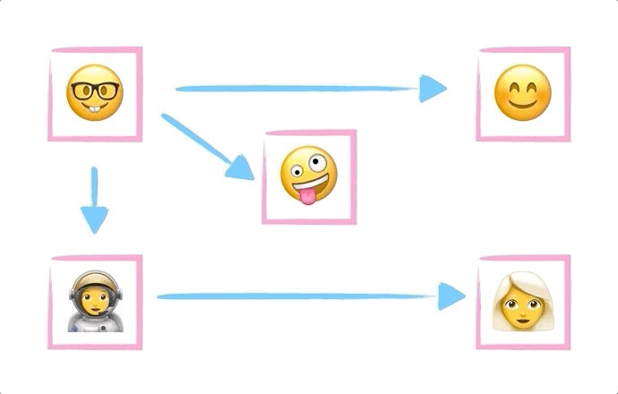

# Write a Depth First Search Algorithm for Graphs in JavaScript

**[📹 Video](https://egghead.io/lessons/javascript-write-a-depth-first-search-algorithm-for-graphs-in-javascript)**

💻[Github repo](https://github.com/kyleshevlin/intro-to-data-structures-and-algorithms/blob/master/graphs/depthFirstSearch.js)

## Summary



Depth first search is similar to the algorithm we looked at in the previous lesson, in that it is also used to traverse each node in a graph. The difference is the order in which nodes are visited. With Depth first search we start at the first node and visit its first neighbor, then that node's first neighbor and so on until we reach a node with no unvisited neighbors. Then we go back up one node and look at its next neighbor, and so on.

Depth first search implements an explore function which is called recursively - the explore function calls itself from within the function - until it reaches a dead end - also known as a leaf node.

## Use cases

- Finding the shortest path between nodes - Google Maps

## Implementation

```js
{
  // graph from previous lessons
  depthFirstSearch(startingNodeKey, visitFn) {
    const startingNode = this.getNode(startingNodeKey)
    const visited = nodes.reduce((acc, node) => {
      acc[node.key] = false
      return acc
    }, {})

    console.log(startingNode)

    function explore(node) {
      if (visited[node.key]) {
        return
      }

      visitFn(node)
      visited[node.key] = true

      node.neighbors.forEach(node => {
        explore(node)
      })
    }

    explore(startingNode)
  }
}
```

---

📹 [Go to Previous Lesson](https://egghead.io/lessons/javascript-breadth-first-javascript-search-algorithm-for-graphs)
📹 [Go to Next Lesson](https://egghead.io/lessons/javascript-tree-data-structure-in-javascript)
