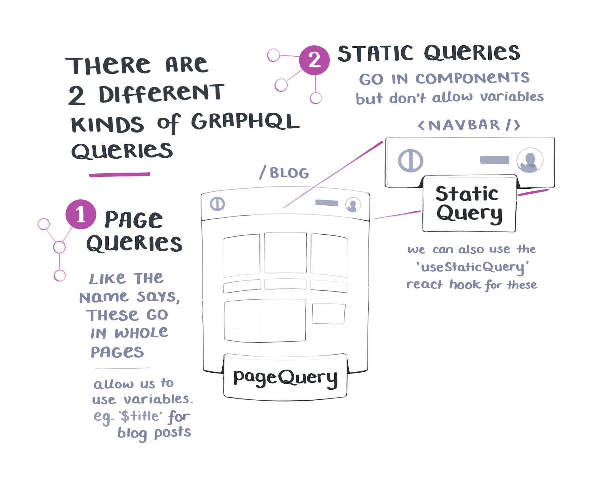

# Fetch and query data at build time in Gatsby

[📹 Video link](https://www.egghead.io/lessons/gatsby-fetch-and-query-data-at-build-time-in-gatsby)

## Notes

It's common to query data from a remote API to use inside of Gatsby at build time.

In this example, we have some data stored in Contentful that matches the structure of our hardcoded JSON.

## Add the `gatsby-source-graphql` Plugin

Install the plugin by running:

```
npm install gatsby-source-graphql
```

Next, we'll add and configure the plugin inside of `gatsby-config.js`.

Full configuration docs can be found on [Gatsby's plugin page](https://www.gatsbyjs.org/packages/gatsby-source-graphql/), but to match the course we will configure it for Contentful.

Add an object to the `plugins` array with a `resolve` key of `'gatsby-source-graphql'`, and some options to connect to Contentful.

In order to let Gatsby use our API key, we'll import the `dotenv` package at the top of the file, and configure it to have a path.

```js
//gatsby-config.js
require('dotenv').config({
  path: `.env.${process.env.NODE_ENV}`,
})

module.exports = {
  plugins: [
    'gatsby-plugin-postcss',
    {
      resolve: `gatsby-source-graphql`,
      options: {
        typeName: `Contentful`,
        fieldName: `contentful`,
        url: `https://contentful-url-here.com`,
        headers: {
          Authorization: `Bearer ${process.env.UR_SECRET_TOKEN}`,
        },
      },
    },
  ],
}
```

## Update `gatsby-node.js`

Inside of `gatsby-node.js` we need to update a few things.

To start, we can remove the hardcoded JSON data.

First, we'll destructure `graphql` from the parameters to our `createPages` function, as well as add the `async` keyword.

```js
exports.createPages = async ({ actions, graphql }) => {
  const { createPage } = actions
  const PokemonTemplate = path.resolve('.src/templates/pokemon.js')
  // ...
}
```

Now we will write our GraphQL query.
We want to query the `contentful` source from our `fieldName` in `gatsby-config.js`, then from our `pokemonCollection` we will look at `items` to get our `slug` and `name`.

We will create a `results` variable that `awaits` our query from calling GraphQL:

```js
const result = await graphql(`
  {
    contentful {
      pokemonCollection {
        items {
          slug
          name
        }
      }
    }
  }
`)
```

We also need to update our `forEach` to iterate over `result.contentful.pokemonCollection.items` instead of our hardcoded JSON data:

```js
result.data.contentful.pokemonCollection.items.forEach(pokemon => ...)
```

When we refresh the server, we can click our Pokemon links as expected.

## GraphQL page vs static queries

Gatsby is capable of handling queries with variables because of its awareness of page context. However, page queries can only be made in top-level page components.



In contrast, static queries do not take variables. This is because static queries are used inside specific components, and can appear lower in the component tree. Data fetched with a static query won’t be dynamic, but they can be called at any level in the component tree.
