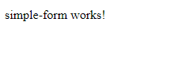

# Create a Simple Angular 2 Component

**[📹 Video](https://egghead.io/lessons/angular-create-a-simple-angular-2-component)**

## Generating our First Component ⚡
With our terminal in the project folder directory (angular2-fundamentals), we can generate a component with the following commmand:
```bash
ng generate component simple-form --inline-template --inline-style
```
The --inline-template and --inline-style flags are added so that the instructor can demonstrate more clearly the styles of the component within one file.

The above command can also be run in a much more abbreviated form:
```bash
ng g c simple-form -it -is
```
- ```ng g c simple-form``` tells the Angular CLI to generate (g) a component (c) with name "simple-form"
- ```-it``` is synonymous with ```--inline-template```
- ```-is``` is synonumous with ```--inline-style```

After running either of the two above commands in the terminal, we should see two new files created at **src/app/simple-form**

Navigate to **src/app/simple-form/simple-form.component.ts**. We should see that the component has a `selector` of `'app-simple-form'`
### simple-form.component.ts
```js
import { Component, OnInit } from '@angular/core';

@Component({
  selector: 'app-simple-form',
  template: `
    <p>
      simple-form works!
    </p>
  `,
  styles: [
  ]
})
export class SimpleFormComponent implements OnInit {

  constructor() { }

  ngOnInit(): void {
  }

}
```
We can now use this selector to display our new component. Return to **src/app/app.component.ts**, and change the `template` property to `<div><app-simple-form></app-simple-form></div>`

### app.component.ts
```js
import { Component } from '@angular/core';

@Component({
  selector: 'app-root',
  template: `<div><app-simple-form></app-simple-form></div>`,
  styleUrls: ['./app.component.css']
})
export class AppComponent {
  title = `Let's get started`;
}
```

If you stopped your development server, start it up again in the terminal:
```bash
ng serve
```
Navigate to localhost:4200 in the browser and you should see "simple-form works!"



The text "simple-form-works" is coming from the template property in **simple-form.component.ts**

The "app-" prefix on our selector "app-simple-form" comes from the `prefix` property found in **angular.json**

As we saw, the selector for our new component is "app-simple-form". The selector for our app component is "app-root" and is defined in the body of **src/index.html**
### index.html
```html
<!doctype html>
<html lang="en">
<head>
  <meta charset="utf-8">
  <title>Angular2Fundamentals</title>
  <base href="/">
  <meta name="viewport" content="width=device-width, initial-scale=1">
  <link rel="icon" type="image/x-icon" href="favicon.ico">
</head>
<body>
  <app-root></app-root>
</body>
</html>
```

We can see the hierarchy of our components in the Chrome devtools


## Resources 📖
- [Angular CLI](https://cli.angular.io/)
- [Angular - Loading Component Styles](https://angular.io/guide/component-styles#loading-component-styles)