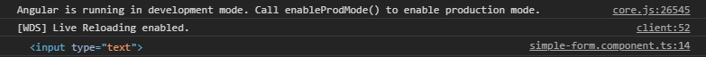

# Manage Angular 2 Elements with Events and Refs

**[📹 Video](https://egghead.io/lessons/angular-manage-angular-2-elements-with-events-and-refs)**

## Creating a User Input ⚡
In our simple form component (**src/app/simple-form/simple-form.component.ts**), we're going to change our component template to be an input field and a button.
### simple-form.component.ts
```js
...
@Component({
  selector: 'app-simple-form',
  template: `<div>
  <input type="text" />
  <button>Click me!</button>
  </div>`,
  styles: [
  ]
})

...
```

Saving our changes and starting our development server:
```bash
ng serve
```
We should be able to see our input and button in the browser at localhost:4200.

## Angular Events ⚡
To handle a click event on our button, we wrap the event, in this case click, with parenthesis and assign it to the desired class method, in this case `onClick()`.

### simple-form.component.ts
```js
...
@Component({
  selector: 'app-simple-form',
  template: `<div>
  <input type="text" />
  <button (click)="onClick()>Click me!</button>
  </div>`,
  styles: [
  ]
})

...
```
We now create our `onClick()` class method:
### simple-form.component.ts
```js
...

export class SimpleFormComponent implements OnInit {
  // new class method onClick()
  onClick() {
    console.log('clicked')
  }
  constructor() { }

  ngOnInit(): void {
  }

}
```
After saving our changes and navigating to localhost:4200, we should be able to see "clicked!" appear in the console after the "Click me!" button is pressed.

## Angular References ⚡
We can create a "myInput" reference on our input element with `#myInput`.

This reference allows us to access the values from the input element and pass them into, say, our `onClick` function, as is done in the following code:
### simple-form.component.ts
```js
...
@Component({
  selector: 'app-simple-form',
  template: `<div>
  <input #myInput type="text" />
  <button (click)="onClick(myInput.value)">Click me!</button>
  </div>`,
  styles: [
  ]
})

...
```

We can now add a value parameter to our `onClick()` method and log the value of the input field to our console.
### simple-form.component.ts
```js
...
export class SimpleFormComponent implements OnInit {
  onClick(value) {
    console.log(value)
  }
  constructor() { }

  ngOnInit(): void {
  }

}
```
Saving our changes and returning to localhost:4200, we should be able to enter text into our input field and log it to the console by clicking our button.

If we remove `.value` from `myInput.value`, save the change, and click the button in the browser, we can see in the console that the input element itself is returned.
### simple-form.component.ts
```js
...
@Component({
  selector: 'app-simple-form',
  template: `<div>
  <input #myInput type="text" />
  <button (click)="onClick(myInput)">Click me!</button>
  </div>`,
  styles: [
  ]
})

...
```

The return value of the reference to an element is no different than the element itself.

## Resources 📖
- [Angular - Template Reference Variables](https://angular.io/guide/template-syntax#template-reference-variables-var)
- [Angular - Event Binding](https://angular.io/guide/template-syntax#event-binding-event)