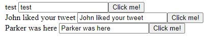
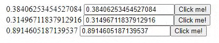

# Sync Values from Inputs with Angular 2’s ngModel Two-Way Binding

**[📹 Video](https://egghead.io/lessons/angular-sync-values-from-inputs-with-angular-2’s-ngmodel-two-way-binding)**

## Updating Our Message with ngModel and Inputs ⚡
In this lesson, we'll use `[(ngModel)]` on our `<input>` element in **src/app/simple-form/simple-form.component.ts**.

### simple-form.component.ts
```js
...
@Component({
  selector: 'app-simple-form',
  template: `<div>
  {{ message }}
  <input #myInput type="text" [(ngModel)]="message"/>
  <button (mouseover)="onClick($event, myInput.value)">Click me!</button>
  </div>`,
  styles: [
  ]
})

...
```

**Note:** In newer versions of angular, we must also import `FormModule` in our **src/app/app.module.ts**:

### app.module.ts
```js
import { BrowserModule } from '@angular/platform-browser';
import { NgModule } from '@angular/core';
// Here:
import { FormsModule } from '@angular/forms';

import { AppComponent } from './app.component';
import { SimpleFormComponent } from './simple-form/simple-form.component';

import { MailService } from './mail.service';

@NgModule({
  declarations: [
    AppComponent,
    SimpleFormComponent
  ],
  imports: [
    BrowserModule,
    // And here:
    FormsModule
  ],
  providers: [
    {provide: "mail", useClass: MailService},
    {provide: "api", useValue: 'http://localhost:3000'}
  ],
  bootstrap: [AppComponent]
})
export class AppModule { }
```
Returning to `[(ngServe)]`...


**"You can think of the square brackets and parentheses in a combination as two-way binding"**

"This is combining two things we've talked about already where the parentheses represent an Event, and the square brackets represents pushing values in on Inputs."

To see this in action, start up the development server,
```bash
ng serve
```
And navigate to localhost:4200. We should see that our message is now contained in our input field.

Furthermore, when we make changes within our input field, the message next to it changes as well.



The Two-Way Binding can be demonstrated by changing our message via means external of the input.

For example, we can change the message every one second:
### simple-form.component.ts
```js
...
export class SimpleFormComponent implements OnInit {

  @Input() message

  onClick(event, value) {
    console.log(event)
    console.log(value)
  }
  constructor() {
    setInterval(()=> this.message = Math.random().toString(), 1000);
  }

  ngOnInit(): void {
  }

}
```
And we can see at localhost:4200 that both our message and the message within the input are changing every second, and changing the message within the input briefly changes it outside of the input.



**'Changing this message from outside of the `<input>` updates it in , changing the message from inside of the `<input>` updates it out. That's what the square brackets and parentheses represent around the ngModel.'**

## Resources 📖
- [Angular - ngModel Directive](https://angular.io/api/forms/NgModel)