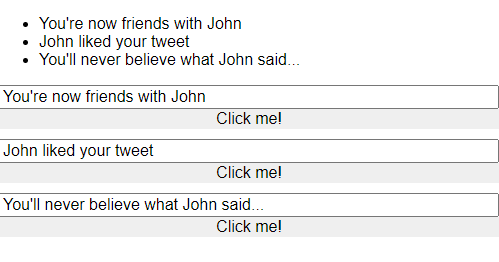
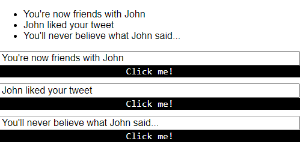
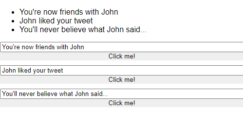

# Use Global CSS Inside Angular 2 Components

**[📹 Video](https://egghead.io/lessons/angular-use-global-css-inside-angular-2-components)**

## Using and Ignoring Global Styles ⚡
Here we'll bring in a stylesheet to our **src/index.html**:
### index.html
```html
<!doctype html>
<html lang="en">
<head>
  <meta charset="utf-8">
  <title>Angular2Fundamentals</title>
  <base href="/">
  <meta name="viewport" content="width=device-width, initial-scale=1">
  <link rel="icon" type="image/x-icon" href="favicon.ico">
  <!-- New Stylesheet -->
  <link rel="stylesheet" href="https://unpkg.com/tachyons@4.5.3/css/tachyons.min.css"/>
</head>
<body>
  <app-root></app-root>
</body>
</html>
```
We can see that it applies to everything in our project after starting our development server and navigating to localhost:4200.

```bash
ng serve
```



Furthermore, we can grab classes from this stylesheet in our components. In **src/app/simple-form/simple-form.component.ts**, we can add `class="white bg-black code` from the stylesheet.

### simple-form.component.ts
```js
...
@Component({
  selector: 'app-simple-form',
  template: `
  <input 
    #myInput 
    type="text" 
    [(ngModel)]="message"
    [ngClass]="{mousedown:isMousedown}"
    (mousedown)="isMousedown = true"
    (mouseup)="isMousedown = false"
    (mouseleave)="isMousedown  = false"
  >
  <button 
  class="white bg-black code"
  (click)="update.emit({text:message})">Click me!</button>
  `,
  styles: [`
    :host{
      display: flex;
      flex-direction: column;
    }
    .mousedown{
      border: 2px solid green;
    }
    input:focus{
      font-weight: bold;
      outline: none;
    }
    button{
      border: none;
    }
    `]
})

...
```



The button text-color, font, and background color are all coming in from that style library passed in to **index.html**.

We can ignore global styles in our component with the `encapsulation` property.

**Note:** At the time of these notes, the `Native` setting used in the video is deprecated and has been replaced by `ShadowDom`.
### simple-forms.component.ts
```js
...
@Component({
  encapsulation: ViewEncapsulation.ShadowDom,
  selector: 'app-simple-form',
  ...
})
...
```

The `ShadowDom` setting means "no styles in, no styles out".

If we save our changes and view our webpage at localhost:4200, we can see that the styles from the global stylesheet have been ignored.



The default `encapsulation` property setting is `Emulated`, which allows global styles in but no styles out.

There also exists the `None` setting, where styles defined within the component are also defined globally.

"I don't really see many use cases for [the None setting], so I almost always leave it on the default, define some styles inline when I need them, and otherwise use the global styles from whatever library I'm using.

## Resources 📖
- [Angular - View Encapsulation](https://angular.io/guide/component-styles#view-encapsulation)
- [Native is now deprecated in favor of ShadowDOM](https://stackoverflow.com/a/53806584)